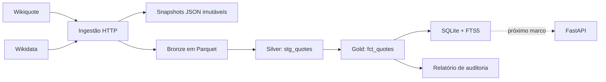

# Pipeline de dados

O Sisyphus começou como uma API que consultava Wikiquote e Wikidata sob demanda.
Esse desenho colocou o produto no ar cedo, mas deixou a seleção editorial
dependente da estrutura atual das páginas. A camada de dados separa três perguntas:

1. O que a fonte publicou?
2. O que conseguimos interpretar com segurança?
3. O que queremos oferecer como parte do produto?

O volume não exige um lakehouse. Parquet, DuckDB e dbt foram escolhidos para
tornar proveniência e curadoria reproduzíveis, sem introduzir um serviço de banco
antes da hora.

## Fluxo



## Bronze: preservar antes de interpretar

Cada execução recebe um `run_id` e grava um diretório próprio em
`data/bronze/{run_id}`. Os JSONs originais de Wikiquote e Wikidata ficam separados,
com SHA-256 no nome e no manifesto. O manifesto também registra a revisão exata do
conteúdo interpretado, o horário da coleta, a versão do parser e o estado da
execução. Assim, duas respostas diferentes nunca sobrescrevem a mesma evidência.

As tabelas de frases e pensadores são exportadas como Parquet comprimido dentro do
mesmo diretório da execução. Uma página válida sem frases produz um Parquet vazio,
sem interromper o restante do pipeline.

## Resiliência proporcional ao produto

A ingestão mantém no máximo quatro pensadores em processamento simultâneo. Cada
requisição pode ser repetida até três vezes quando ocorre timeout, falha de rede ou
resposta HTTP transitória (`408`, `429`, `5xx` selecionados). Erros permanentes,
como `404`, não são repetidos. O intervalo usa backoff curto com jitter e respeita
`Retry-After` numérico, limitado a 30 segundos.

Não há fila, worker distribuído ou serviço de cache. Se uma fonte continuar
indisponível, o manifesto identifica o pensador e o tipo da falha, o warehouse não
é atualizado e o último SQLite válido permanece intacto.

## Silver: identidade e normalização

`stg_quotes` normaliza espaços e calcula o tamanho. `quote_id` identifica o conteúdo
por QID e texto normalizado; `occurrence_id` identifica sua ocorrência editorial,
incluindo categoria, obra e revisão da fonte. Os dois IDs são SHA-256 estáveis.
Essa separação permite reconhecer a mesma frase sem apagar mudanças de contexto.

## Gold: decisão editorial explícita

`fct_quotes` não reduz qualidade a um booleano opaco. Cada registro recebe
`curation_status`, `quality_reasons`, `passes_automatic_rules`,
`editorial_approved` e `is_daily_eligible`. `quality_reasons` preserva todos os
motivos encontrados. `quality_reason` continua disponível como motivo principal
para consultas e relatórios compactos.

| Condição | Estado | Motivo |
|---|---|---|
| Referência bibliográfica sem frase | rejeitado | `citation_only` |
| Menos de 40 caracteres | revisão | `short_text` |
| Mais de 500 caracteres | revisão | `long_text` |
| Seção de atribuídas | revisão | `attributed_quote` |
| Nenhuma ocorrência acima | aceito | `passed_automatic_rules` |

Os limites não afirmam que uma frase curta, longa ou atribuída esteja errada. Eles
dizem que uma pessoa deve avaliá-la antes que o produto a destaque. Passar pelas
regras automáticas também não basta: `dbt/seeds/daily_quote_selection.csv` contém
uma allowlist revisada manualmente, inicialmente com uma frase para cada um dos 18
pensadores. `is_daily_eligible` só é verdadeiro quando as duas condições passam.

Essa distinção retirou `Memorabilia IV. 8.8` e trechos narrativos do conjunto
diário sem apagá-los da camada de origem. Se uma edição da fonte mudar o texto e,
portanto, seu `quote_id`, o gate bloqueia a publicação até nova revisão humana.

## Artefato de publicação

`data/sisyphus.db` é reconstruído a partir da gold. Ele contém proveniência,
licença, chaves, índices e uma tabela FTS5 para busca textual. O pipeline primeiro
monta e valida um candidato; somente depois substitui o arquivo vigente com uma
operação atômica. Uma falha mantém intacto o último artefato válido.

`build_metadata` identifica o schema, o conteúdo integral servido, o `run_id`, as
versões do pipeline e do parser, o SHA-256 do manifesto e o commit que gerou o
artefato. `dataset_version` ignora apenas horários de coleta: qualquer mudança nos
pensadores ou campos publicados das frases produz uma nova versão.

O endpoint `/v1/quote-of-the-day` lê esse SQLite em modo somente leitura. A seleção
considera apenas `is_daily_eligible`, permanece estável para a mesma data, filtros e
versão do dataset, e informa `dataset_version` e `dataset_schema` na resposta. Os
demais endpoints continuam consultando as fontes ao vivo.

Não existe fallback silencioso. Se o arquivo estiver ausente, ilegível, com
proveniência inválida ou schema incompatível, a rota responde `503` em
`application/problem+json`. `/health/dataset` verifica somente esse artefato e pode
ser usado no contêiner sem depender da disponibilidade momentânea da Wikimedia.

Antes da troca do arquivo, a publicação exige todos os pensadores do catálogo e ao
menos uma frase elegível para cada um deles. Esses gates cobrem as falhas destrutivas
para o MVP sem presumir volume ou infraestrutura que o produto ainda não possui.

## Execução

```bash
python run_pipeline.py
```

Também é possível executar `ingest`, `transform`, `publish` ou `audit` como
argumento. O resultado local inclui snapshots JSON, Parquet bronze, o warehouse
DuckDB, o SQLite de publicação e `reports/data-quality.html`.

Os artefatos derivados não são versionados no Git. O código, as regras, os testes e
o lock completo de dependências são.

## Disponibilização para a API

A aplicação procura `data/sisyphus.db` por padrão. Outro caminho pode ser informado
em `SISYPHUS_SERVING_DB_PATH`. `Dockerfile.release` cria uma imagem mínima com o
SQLite validado e mantém bronze, DuckDB e dbt fora do runtime. O Dockerfile atual
permanece como caminho de desenvolvimento e legado. Em produção, a frase do dia já
é servida pela imagem curada; os demais endpoints continuam consultando as fontes
ao vivo durante a migração gradual.

O workflow manual `release-image.yml` reconstrói a base, repete a validação, testa a
imagem como usuário sem privilégios e só publica no GHCR quando `publish_image` é
explicitamente habilitado. Publicar uma imagem e configurar o Railway continuam
sendo decisões separadas. O procedimento está em [`RELEASE.md`](RELEASE.md).

## Limite atual

O pipeline preserva a URL e a revisão da página, mas o parser ainda não guarda a
referência específica exibida abaixo de algumas frases. Extrair obra, edição e
passagem sem misturá-las ao texto será a próxima evolução da camada silver.
