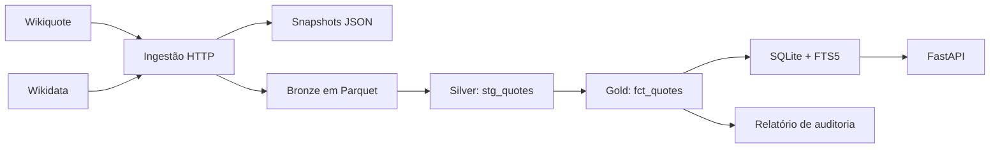

# Pipeline de dados

O Sisyphus começou como uma API que consultava Wikiquote e Wikidata sob demanda.
Esse desenho colocou o produto no ar cedo, mas deixou a seleção editorial
dependente da estrutura atual das páginas. A camada de dados separa três perguntas:

1. O que a fonte publicou?
2. O que conseguimos interpretar com segurança?
3. O que queremos oferecer como parte do produto?

O volume não exige um lakehouse. Parquet, DuckDB e dbt foram escolhidos para
tornar proveniência e curadoria reproduzíveis, sem introduzir um serviço de banco
antes da hora.

## Fluxo



## Bronze: preservar antes de interpretar

Cada coleta registra nome solicitado, título canônico, QID, revisão da página e
horário UTC. O JSON original das duas fontes é salvo em
`data/bronze/{qid}-{revision}.json`. As tabelas de frases e pensadores também são
exportadas como Parquet comprimido.

## Silver: identidade e normalização

`stg_quotes` normaliza espaços, calcula o tamanho e gera `quote_id` a partir do
QID e do texto normalizado. Repetir o pipeline sobre a mesma fonte produz os
mesmos IDs. Duplicatas preservam a coleta mais recente.

## Gold: decisão editorial explícita

`fct_quotes` não reduz qualidade a um booleano opaco. Cada registro recebe
`curation_status`, `quality_reason` e `is_daily_eligible`.

| Condição | Estado | Motivo |
|---|---|---|
| Referência bibliográfica sem frase | rejeitado | `citation_only` |
| Menos de 40 caracteres | revisão | `short_text` |
| Mais de 500 caracteres | revisão | `long_text` |
| Seção de atribuídas | revisão | `attributed_quote` |
| Nenhuma ocorrência acima | aceito | `passed_automatic_rules` |

Os limites não afirmam que uma frase curta, longa ou atribuída esteja errada.
Eles dizem que uma pessoa deve avaliá-la antes que o produto a destaque. Foi essa
distinção que retirou `Memorabilia IV. 8.8` do conjunto diário sem apagar o
registro da camada de origem.

## Artefato de publicação

`data/sisyphus.db` é reconstruído a partir da gold. Ele contém chaves, índices e
uma tabela FTS5 para busca textual. Não é fonte de verdade e não recebe migração.
Se o esquema mudar, o pipeline gera outro arquivo.

## Execução

```bash
python run_pipeline.py
```

Também é possível executar `ingest`, `transform`, `publish` ou `audit` como
argumento. O resultado local inclui snapshots JSON, Parquet bronze, o warehouse
DuckDB, o SQLite de publicação e `reports/data-quality.html`.

Os artefatos derivados não são versionados. O código, as regras e os testes são.

## Limite atual

O pipeline preserva a URL e a revisão da página, mas o parser ainda não guarda a
referência específica exibida abaixo de algumas frases. Extrair obra, edição e
passagem sem misturá-las ao texto será a próxima evolução da camada silver.
